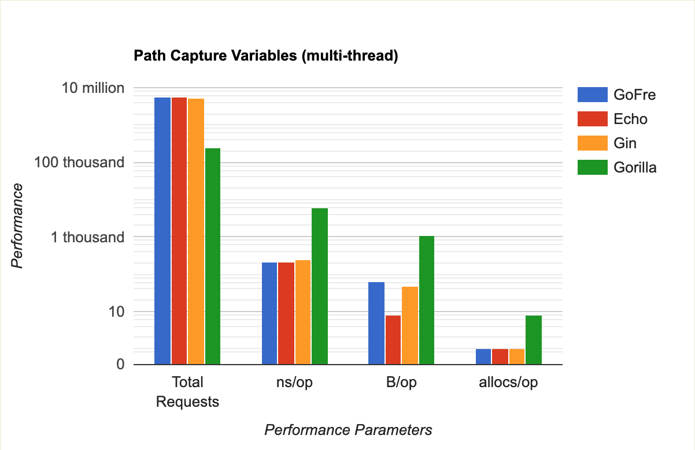
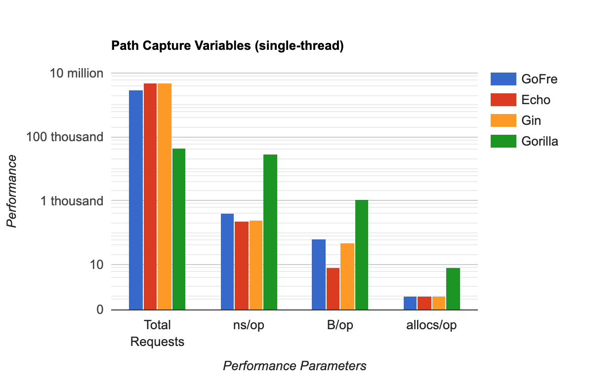
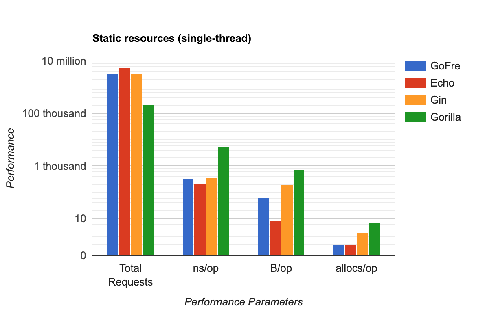

<h1 align="center"> Go Web Frameworks Benchmark</h1>

Benchmark results between [GoFre](https://github.com/ixtendio/gofre) and other popular Go web frameworks

The benchmark was executed on `MacOS Intel(R) Core(TM) i7-4980HQ CPU @ 2.80GHz`
